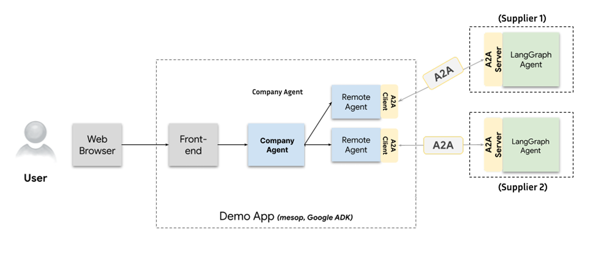

# Agent2Agent (A2A) Stock Management System

A robust implementation of the **Agent2Agent (A2A)** protocol designed to manage stock operations, product queries, and order processing through a collaborative multi-agent architecture. This system demonstrates standardized communication between a central Host Agent and remote Supplier Agents using AI-driven interactions.

## 📋 Project Overview

This project implements an **Agent-to-Agent (A2A)** system compliant with the A2A protocol specification. It is designed to handle enterprise-level inventory tasks such as:
* Retrieving product details and stock levels.
* Generating offers and quotes.
* Placing orders securely.
* Managing customer information.

The architecture features a **Host Agent** (Company Agent) that coordinates with **Remote Agents** (Supplier Agents) to fulfill user requests in real-time, utilizing asynchronous streaming for status updates.

## 🏗️ Architecture

The system is built upon a Client-Server model that ensures modularity and scalability:

* **A2A Server:** Built with **Starlette**, exposing HTTP endpoints compliant with A2A standards.
* **Host Agent:** Acts as the central orchestrator, interfacing with the frontend and delegating tasks to remote agents.
* **Remote Agents:** Independent AI agents (e.g., Supplier Agents) that perform specific tasks like checking external database stocks.
* **Communication:** Uses **JSON-RPC 2.0** over HTTP(S) for data exchange and **Server-Sent Events (SSE)** for real-time streaming.

## ✨ Key Features

* **Dynamic Agent Discovery:** Utilizing **Agent Cards** to define and broadcast agent identity, capabilities, and skills (e.g., `get_products_info`, `place_order`).
* **Real-Time Streaming:** Asynchronous feedback loop providing users with immediate status updates (e.g., "Processing exchange rates...") before the final result.
* **Multi-Turn Conversations:** Stateful interactions managed via `MemorySaver`, allowing agents to request missing information (like Customer IDs) during a transaction.
* **Database Integration:** Direct connection to **Oracle** and **MySQL** databases for persistent management of inventory and orders.

## 🛠️ Technical Stack

* **Language:** Python 3.10+
* **Frameworks:** Starlette, Uvicorn, A2A SDK
* **AI/LLM:** Google Gemini, LangChain, LangGraph
* **Database:** Oracle DB, MySQL
* **Frontend:** Mesop / Google ADK (Demo App)

## 📂 Repository Structure

| File | Description |
| :--- | :--- |
| `__main__.py` | Entry point. Configures the A2A server, builds the **Agent Card**, and handles the application launch. |
| `agent_executor.py` | Manages the task execution loop for remote agents, handling state transitions (`working`, `input_required`, `completed`). |
| `agent.py` | Contains the **Supplier Agent** logic. Defines tools for Oracle DB interactions (stock checks, order creation) and Gemini LLM integration. |
| `company_agent_executor.py` | Manages execution for the Host (Company) Agent, bridging the server and local business logic. |
| `company_agent.py` | Contains the **Company Agent** logic. Handles local product queries and coordinates with remote suppliers. |

## 🚀 Installation & Setup

### Prerequisites
* Python 3.10 or higher
* Access to an Oracle or MySQL database
* A Google Cloud API Key (for Gemini)

